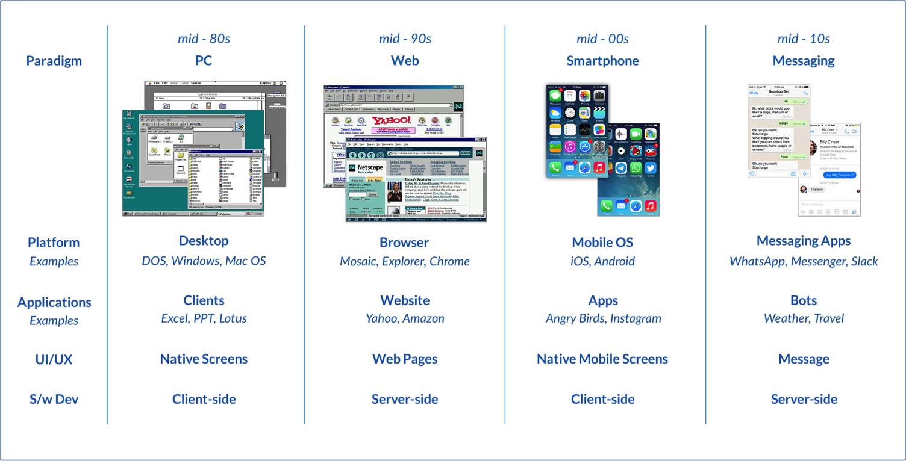
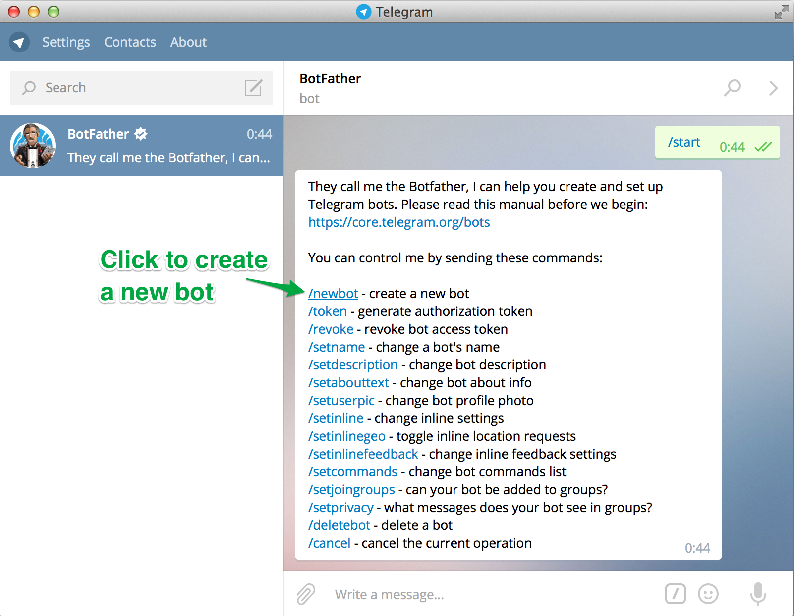
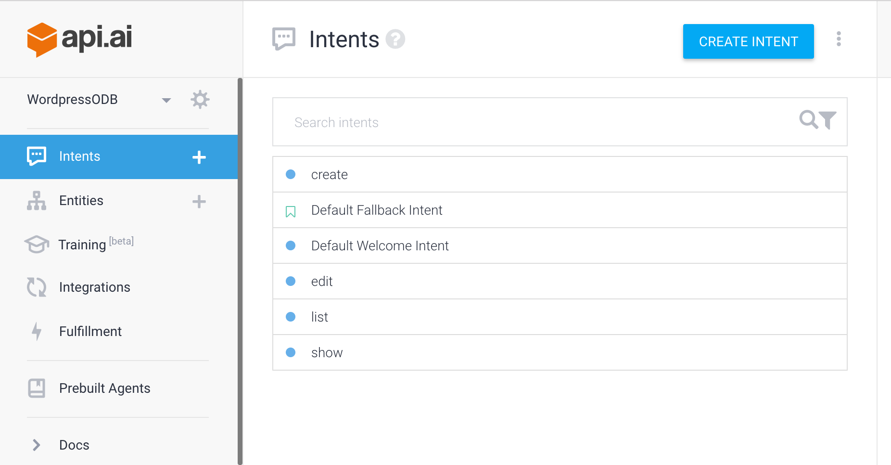
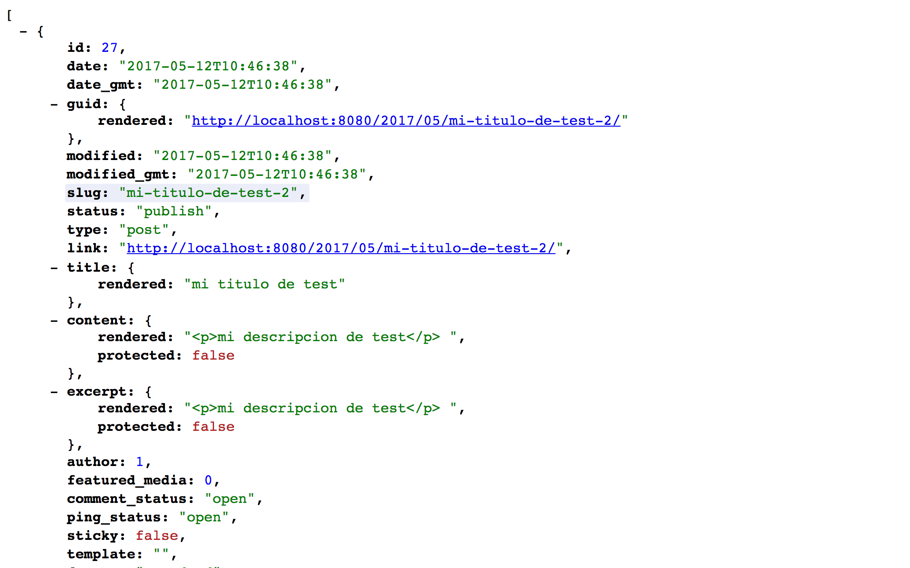
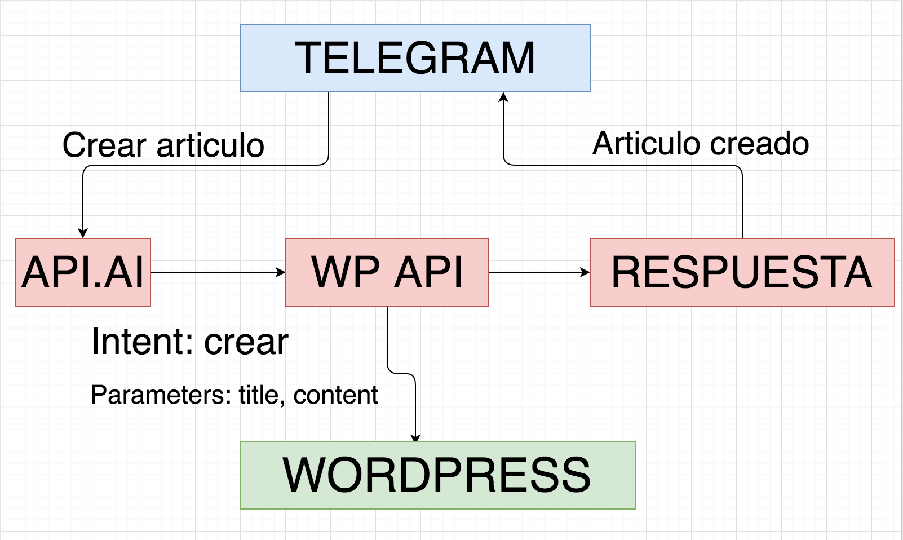

class: center, middle, inverse

# Hazte un chatbot para Wordpress

(Usando la WP Rest API)

---

class: inverse, center

# @javaguirre

---

class: inverse, center

# Bots

* Automatiza tarea
* Imita comportamiento humano

---

class: inverse, center

# Cambio de paradigma

[An introduction to chat bots](http://es.slideshare.net/sohanmaheshwar/an-introduction-to-chat-bots)

---

class: inverse, center

# Por dónde empezamos

---

class: inverse, center

# Telegram

[Documentación](https://docs.api.ai/docs/telegram-integration)

---

class: inverse, center

# API.AI

---

class: inverse, center

# WP REST API

---

class: inverse, center

# Arquitectura

---

class: inverse, center

# Manos a la obra

---

class: inverse, center, middle

# Gracias
#### Javier Aguirre [@javaguirre](https://javaguirre.me)
#### [Github](https://github.com/javaguirre) | [Twitter](https://twitter.com/javaguirre)
